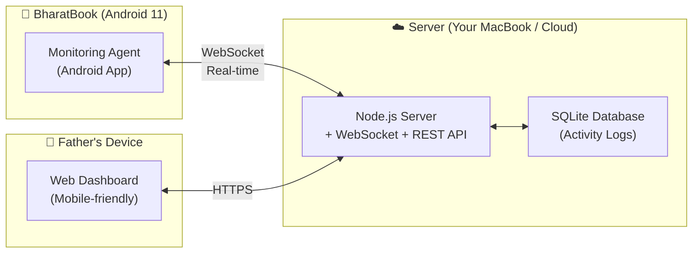

# 🛡️ BharatWatch — Parental Monitoring & Control System for BharatBook

A remote monitoring and control app that lets your father check on your sister's BharatBook (Android 11) activities from anywhere — take screenshots, lock the device, view running apps, and track usage history.

## Architecture Overview

## How It Works

### 1. BharatBook Agent (Android App)
An Android app installed on the BharatBook that runs as a background service and:
- **Captures screenshots** on command from the server
- **Locks the screen** when the father triggers it
- **Reports running apps** every 30 seconds
- **Tracks app usage** and website history
- **Stays alive** using a foreground notification ("Study Mode Active 📚")

### 2. Control Server (Node.js)
A lightweight Node.js server that acts as the bridge:
- Maintains a persistent WebSocket connection with the BharatBook agent
- Stores activity logs in SQLite
- Serves the web dashboard
- Handles commands (screenshot, lock, etc.)
- Works over the internet via your home WiFi + port forwarding (or a free tunnel like ngrok/Cloudflare)

### 3. Web Dashboard (Father's Device)
A beautiful, mobile-friendly web dashboard accessible from any browser:
- **Live status** — Is BharatBook online? What app is she using right now?
- **Screenshot** — One-tap to capture and view the current screen
- **Lock/Unlock** — Instantly lock the device remotely
- **Activity Timeline** — Full history of app usage with timestamps
- **Running Apps** — See all foreground & background processes
- **Screen Time Stats** — Daily/weekly usage breakdown by app

---

## User Review Required

> [!IMPORTANT]
> **Android App Installation**: Since BharatBook runs Android 11, we need to build a proper Android app (APK) that your sister installs on the device. This requires:
> - Enabling "Install from Unknown Sources" on the BharatBook
> - Granting special permissions: Usage Stats, Device Admin (for locking), Screenshot/Media Projection
> - The app will show a persistent notification ("Study Mode") so Android doesn't kill it

> [!WARNING]
> **Internet Access Setup**: For your father to monitor from anywhere (not just home WiFi), we need one of:
> - **Option A**: Use a free tunneling service like [ngrok](https://ngrok.com) or Cloudflare Tunnel (easiest, recommended to start)
> - **Option B**: Set up port forwarding on your home router
> - **Option C**: Deploy the server to a free cloud service (Render, Railway, etc.)
>
> I recommend **Option A (ngrok)** to start — zero config, works immediately.

> [!CAUTION]
> **Screenshot Limitation on Android**: Android requires the user to grant a one-time "Screen Capture" permission via a system dialog when the app first starts. After that, screenshots work silently. This is an Android security requirement we cannot bypass.

---

## Open Questions

> [!IMPORTANT]
> 1. **Stealth vs. Transparent**: Should the app be hidden/stealthy, or is it okay for your sister to know it's running? (Android 11 requires a visible notification for background services, but we can make it look like a "Study Helper" app)
>
> 2. **Server hosting**: Do you want to run the server on your MacBook (needs to stay on), or deploy it to the cloud? For starting, MacBook is fine.
>
> 3. **Authentication**: Should the dashboard have a password/PIN so only your father can access it?

---

## Proposed Changes

We'll build **3 components** in the `/Users/universeboss/Desktop/Tracking` workspace:

---

### Component 1: Control Server + Web Dashboard (Node.js)

This is the brain of the system — receives data from the BharatBook and serves the dashboard.

#### [NEW] [package.json](file:///Users/universeboss/Desktop/Tracking/package.json)
- Node.js project with dependencies: `express`, `ws` (WebSocket), `better-sqlite3`, `multer` (for screenshot uploads)

#### [NEW] [server.js](file:///Users/universeboss/Desktop/Tracking/server.js)
- Express server with REST API + WebSocket server
- **WebSocket endpoints** (for BharatBook agent):
  - `agent:connect` — Agent registers itself
  - `agent:heartbeat` — Periodic ping to confirm online status
  - `agent:apps` — Receives list of running apps
  - `agent:screenshot` — Receives screenshot image data
  - `agent:activity` — Receives app usage events
- **REST API endpoints** (for dashboard):
  - `GET /api/status` — Device online/offline, current app
  - `POST /api/screenshot` — Request a screenshot
  - `POST /api/lock` — Lock the device
  - `POST /api/unlock` — Unlock the device
  - `GET /api/activities` — Get activity history
  - `GET /api/apps` — Get running apps list
  - `GET /api/screentime` — Get screen time statistics
  - `GET /api/screenshots/:id` — Get a captured screenshot image

#### [NEW] [db.js](file:///Users/universeboss/Desktop/Tracking/db.js)
- SQLite database setup and helper functions
- Tables: `activities`, `screenshots`, `app_sessions`, `commands`

#### [NEW] [public/](file:///Users/universeboss/Desktop/Tracking/public/)
- The web dashboard (served as static files)

#### [NEW] [public/index.html](file:///Users/universeboss/Desktop/Tracking/public/index.html)
- Single-page dashboard with all monitoring features
- Mobile-first responsive design

#### [NEW] [public/style.css](file:///Users/universeboss/Desktop/Tracking/public/style.css)
- Premium dark theme with glassmorphism
- Card-based layout, smooth animations
- Color-coded app categories (study = green, entertainment = red, etc.)

#### [NEW] [public/app.js](file:///Users/universeboss/Desktop/Tracking/public/app.js)
- Dashboard logic: fetch status, display activities, handle commands
- Real-time updates via WebSocket
- Screenshot viewer, activity timeline, screen time charts

---

### Component 2: Android Agent App (BharatBook)

A lightweight Android app that runs on the BharatBook.

#### [NEW] [android-agent/](file:///Users/universeboss/Desktop/Tracking/android-agent/)
- Complete Android Studio project structure

#### Key files:
- **`MainActivity.kt`** — Initial setup, permission requests, starts the background service
- **`MonitoringService.kt`** — Foreground service that:
  - Maintains WebSocket connection to server
  - Captures screenshots via MediaProjection API
  - Queries UsageStatsManager for app usage
  - Lists running processes
  - Handles lock commands via DeviceAdminReceiver
- **`DeviceAdminReceiver.kt`** — Handles device lock/unlock commands
- **`ScreenCaptureService.kt`** — Handles screen capture via MediaProjection
- **`WebSocketClient.kt`** — Manages persistent connection to server with auto-reconnect
- **`AndroidManifest.xml`** — Required permissions and service declarations

---

### Component 3: Setup & Documentation

#### [NEW] [README.md](file:///Users/universeboss/Desktop/Tracking/README.md)
- Complete setup guide for all three components
- Step-by-step instructions for:
  1. Starting the server on MacBook
  2. Installing the Android app on BharatBook
  3. Granting required permissions
  4. Setting up internet access (ngrok)
  5. Accessing the dashboard

#### [NEW] [setup.sh](file:///Users/universeboss/Desktop/Tracking/setup.sh)
- One-click setup script for the server (installs dependencies, initializes DB)

---

## Tech Stack Summary

| Component | Technology | Why |
|-----------|-----------|-----|
| Server | Node.js + Express | Lightweight, great WebSocket support |
| Real-time Communication | WebSocket (ws) | Bi-directional, low latency |
| Database | SQLite | Zero config, file-based, perfect for this scale |
| Dashboard | Vanilla HTML/CSS/JS | No build step, instant load, mobile-friendly |
| Android Agent | Kotlin + Android SDK | Native Android, best access to system APIs |
| Internet Access | ngrok (free tier) | Zero-config tunneling |

---

## Feature Breakdown

| Feature | How It Works |
|---------|-------------|
| 📸 **Live Screenshot** | Father taps "Capture" → Server sends command via WebSocket → Agent captures screen via MediaProjection → Image sent back → Displayed on dashboard |
| 🔒 **Remote Lock** | Father taps "Lock" → Server sends command → Agent triggers DeviceAdmin lockNow() → Screen locks instantly |
| 📱 **Running Apps** | Agent queries ActivityManager every 30s → Sends list to server → Dashboard shows in real-time |
| 📊 **Screen Time** | Agent uses UsageStatsManager → Logs app open/close events → Server aggregates daily/weekly stats |
| 📜 **Activity Timeline** | Every app switch is logged with timestamp → Displayed as a scrollable timeline on dashboard |
| 🟢 **Online Status** | WebSocket heartbeat every 10s → Dashboard shows green/red indicator |

---

## Verification Plan

### Automated Tests
- Server API endpoint tests
- WebSocket connection/reconnection tests
- Database operations tests

### Manual Verification
1. Start server on MacBook, verify dashboard loads at `http://localhost:3000`
2. Build Android APK and install on BharatBook (or Android emulator for testing)
3. Verify WebSocket connection establishes
4. Test each feature: screenshot capture, device lock, activity listing
5. Test internet access via ngrok tunnel
6. Test on father's phone browser (mobile responsiveness)

---

## Development Order

1. **Phase 1**: Server + Dashboard (can test with a mock agent)
2. **Phase 2**: Android Agent app
3. **Phase 3**: Internet access setup (ngrok) + Polish

I'll start with Phase 1 so we can see the dashboard working immediately with simulated data, then build the Android agent.
