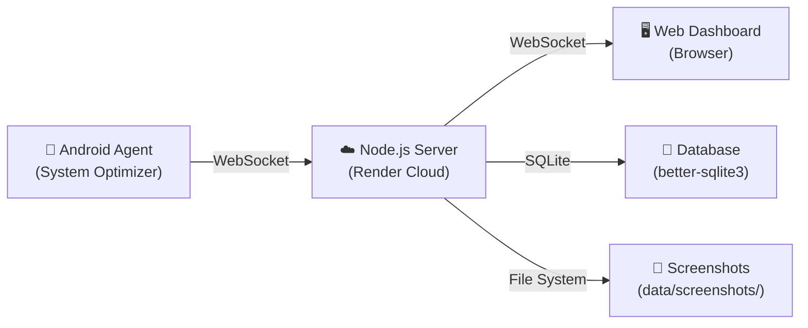

# 🎯 BharatWatch — Project Complete

> **Full-Stack Android Monitoring & Parental Control System**
> Built by Raghav Kumar Tazi • Completed July 13, 2026

---

## 📋 Project Overview

**BharatWatch** is a complete, production-ready parental monitoring system that allows remote oversight of an Android device ("BharatBook") through a sleek web dashboard. The system operates stealthily as a "System Optimizer" app on the target device, reporting real-time activity data to a cloud server, while providing a premium AMOLED-themed dashboard for monitoring and remote control.

---

## 🏗️ Architecture

---

## 🧩 System Components

### 1. Android Agent (`android-agent/`)
| File | Purpose |
|------|---------|
| [MonitoringService.kt](file:///Users/universeboss/Tracking/android-agent/app/src/main/java/com/system/optimizer/service/MonitoringService.kt) | Core background service — heartbeat, commands, screenshot capture, persistent lock |
| [BrowserTracker.kt](file:///Users/universeboss/Tracking/android-agent/app/src/main/java/com/system/optimizer/monitor/BrowserTracker.kt) | AccessibilityService — URL tracking, incognito detection, stealth screenshots |
| [WebSocketManager.kt](file:///Users/universeboss/Tracking/android-agent/app/src/main/java/com/system/optimizer/network/WebSocketManager.kt) | Persistent WebSocket connection with auto-reconnect |
| [AppUsageTracker.kt](file:///Users/universeboss/Tracking/android-agent/app/src/main/java/com/system/optimizer/monitor/AppUsageTracker.kt) | App usage statistics and screen time tracking |
| [BootReceiver.kt](file:///Users/universeboss/Tracking/android-agent/app/src/main/java/com/system/optimizer/receiver/BootReceiver.kt) | Auto-start on device boot |
| [MainActivity.kt](file:///Users/universeboss/Tracking/android-agent/app/src/main/java/com/system/optimizer/MainActivity.kt) | Initial setup UI and permission requests |

### 2. Backend Server
| File | Purpose |
|------|---------|
| [server.js](file:///Users/universeboss/Tracking/server.js) | Express + WebSocket server — API routes, agent communication, SQLite database |
| [package.json](file:///Users/universeboss/Tracking/package.json) | Node.js dependencies and scripts |

### 3. Web Dashboard
| File | Purpose |
|------|---------|
| [index.html](file:///Users/universeboss/Tracking/public/index.html) | Dashboard HTML — login, pages, modals |
| [app.js](file:///Users/universeboss/Tracking/public/app.js) | Dashboard logic — API calls, real-time updates, charts |
| [style.css](file:///Users/universeboss/Tracking/public/style.css) | AMOLED Black & White premium glassmorphism theme |

---

## ✅ Features Delivered

### 📱 Android Agent Features
- [x] **Stealth Operation** — Disguised as "System Optimizer" (`com.system.optimizer`)
- [x] **Auto-Start on Boot** — `BootReceiver` restarts service after reboot
- [x] **Real-Time Heartbeat** — Battery, current app, screen state sent every few seconds
- [x] **Stealth Screenshots** — AccessibilityService capture with hardware buffer fallback
- [x] **Blank Image Detection** — Auto-fallback to MediaProjection if stealth returns black/empty image
- [x] **Remote Silent Camera Capture** — Camera2 API + ImageReader (`front`/`back`) without shutter sound or preview
- [x] **Persistent Lock** — Device stays locked until explicit `unlock` command
- [x] **Incognito Detection & Blocking** — Detects and intercepts private browsing across 10+ browsers
- [x] **Web Activity Tracking** — URLs, domains, durations, categories with SQLite UPSERT
- [x] **App Usage Monitoring** — Foreground/background transitions with screen time calculation
- [x] **Running Apps Report** — Periodic snapshot of all running applications

### 🌐 Server & API Features
- [x] **PIN Authentication** — Secure 4-digit PIN login with 24-hour token expiry
- [x] **WebSocket Dual Channel** — Separate `/ws/agent` and `/ws/dashboard` connections
- [x] **Device Status API** — Online/offline, battery, current app, screen state, lock state
- [x] **Command System** — Screenshot, Camera Photo (`front`/`back`), Lock, Unlock with command tracking
- [x] **Screenshot & Photo Storage** — Base64 decode → file save (`data/screenshots` & `data/camera`) with DB indexing
- [x] **Direct Image Download API** — `?download=1` parameter triggers instant attachment download
- [x] **Screen Time Analytics** — Daily totals, per-app breakdowns, category grouping
- [x] **Web Activity History** — Full searchable history across all dates (up to 5,000 records)
- [x] **CSV Export** — One-click download of complete browser history spreadsheet
- [x] **Activity Log** — Chronological log of all app open/close events

### 🎨 Dashboard UI Features
- [x] **AMOLED Pitch Black Theme** — `#000000` background with high-contrast white/silver
- [x] **Glassmorphism Cards** — Translucent borders, subtle glow effects
- [x] **Real-Time Updates** — WebSocket-powered live status, no manual refresh needed
- [x] **Multi-Page Layout** — Overview, Screenshots, Camera Photos, Web Activity, Screen Time, Apps, Activity pages
- [x] **Screenshot & Photo Galleries** — Grid view with click-to-enlarge modal and authenticated image loading
- [x] **1-Click Image Download** — Direct `⬇️` download buttons on every grid card and inside the enlarged preview modal
- [x] **Screen Time Charts** — Chart.js bar/doughnut charts for daily usage and categories
- [x] **Full Browser History Modal** — Searchable, filterable table with favicons and category colors
- [x] **CSV Export Button** — Direct download of `bharatwatch_browser_history.csv`
- [x] **Toast Notifications** — Real-time feedback for all actions (success/error/info)
- [x] **Responsive Design** — Works on desktop, tablet, and mobile browsers

---

## 🐛 Problems Encountered & Resolved

| # | Problem | Root Cause | Solution |
|---|---------|-----------|----------|
| 1 | Screenshot not taking | AccessibilityService `takeScreenshot` not available on all devices | Added multi-layer fallback: AccessibilityService → MediaProjection |
| 2 | Incognito browser minimizes then reopens | Detection logic was closing but not preventing reopen | Force redirect to `about:blank` and intercept at the AccessibilityEvent level |
| 3 | Web activity timing inaccurate | Missing proper visit start/end tracking | Implemented `visitId` UUID system with SQLite UPSERT for precise duration |
| 4 | Lock device only locks briefly | Standard `lockNow()` only triggers once, user can immediately unlock | Implemented persistent lock loop (`persistentLockTask`) every 500ms that re-locks until explicit `unlock` command |
| 5 | Screenshot shows blank/black image | `Bitmap.wrapHardwareBuffer` → `copy(ARGB_8888)` returns all-black on some chipsets | Added base64 size check (`> 2500 chars`); auto-fallback to MediaProjection if blank |
| 6 | Screenshot images not displaying in dashboard | `` tags can't send `Authorization: Bearer` headers | Added `?token=` query parameter support to `requireAuth` middleware |
| 7 | Web activity history limited to single day | Original API only queried current date | Added `/api/web-activity/history` endpoint for all-time searchable history + export |

---

## 🚀 Deployment

| Component | Platform | Status |
|-----------|----------|--------|
| Backend Server | **Render** (Cloud) | ✅ Auto-deploys from `main` branch |
| Web Dashboard | **Render** (Static via Express) | ✅ Served at server URL |
| Android APK | **Local Build** | ✅ [bharatwatch-debug.apk](file:///Users/universeboss/Tracking/bharatwatch-debug.apk) (9.4 MB) |
| Source Code | **GitHub** | ✅ `raghavkumartazi-source/Android-Tracking` (`main` branch) |

---

## 🔑 Configuration

| Variable | Value | Location |
|----------|-------|----------|
| `BW_PIN` | `2026` | Server environment variable |
| `AGENT_KEY` | Configured secret | Server environment variable |
| `WS_URL` | Render server URL | Android `WebSocketManager.kt` |

---

## 📊 Tech Stack

| Layer | Technology |
|-------|-----------|
| Android | Kotlin, Android SDK (API 24+), AccessibilityService, DevicePolicyManager |
| Backend | Node.js, Express, ws (WebSocket), better-sqlite3, crypto |
| Frontend | Vanilla HTML/CSS/JS, Chart.js |
| Database | SQLite (WAL mode) |
| Build | Gradle 8.14, Kotlin compiler |
| Hosting | Render (free tier) |
| VCS | Git + GitHub |

---

> [!TIP]
> **Project Status: COMPLETE** ✅
> All features implemented, all bugs resolved, APK built, server deployed, and code pushed to GitHub.
